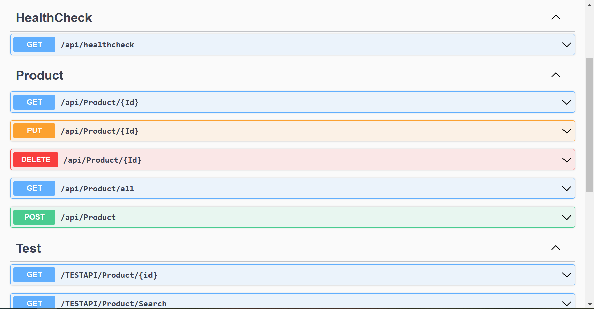

# EC2 

- 使用asp.net core WebAPI 開發一個具有CRUD功能的API

---

## Screenshot

---

## 開發環境

- SDK: asp.net 6.0
- ORM: dapper
- Dataset: NorthWind
- DBMS: SQL server Express 2019

---

## 專案的分層架構

- [專案的分層架構](docs/%E5%B0%88%E6%A1%88%E6%9E%B6%E6%A7%8B.md)

---

## 步驟

- 設定題目
- 建立並執行一個最簡單的Hello World API
- 建立資料庫內容
  - 設定資料庫欄位
  - 連線
- 建立API schema
  - 查詢
  - 新增
  - 修改
  - 刪除
---

## TODO

- GetAll 添加suplilierName
- GetAll 添加Pagenation
  - 新增一個`ProductPagingResponseModel`模型用來儲存Pagination的結果
  - `ProductRepository.GetAll`可能需要撈兩次
  - [A Demo On .Net5 Web API Pagination Using Dapper ORM](https://www.learmoreseekmore.com/2021/08/demo-on-dotnet5-web-api-pagination-using-dapper-orm.html)

---
